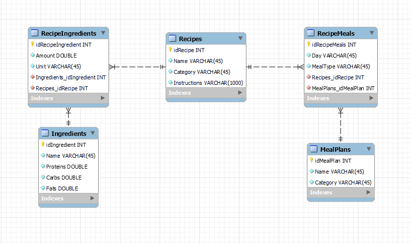
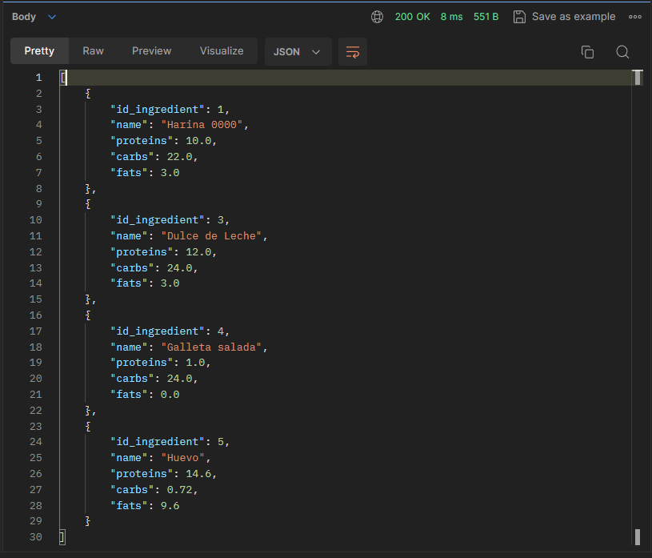
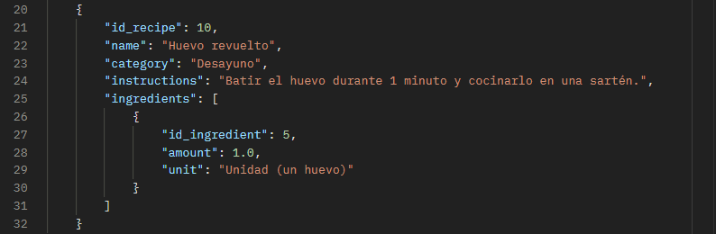
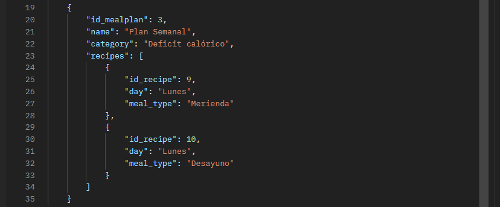

Paradigmas de Programación - 2023 - Trabajo Práctico III

# Trabajo Práctico N°3 - Implementación de una _Rest API_ para un plan de comidas en lenguaje *Rust* utilizando *framework Rocket*.

> [!NOTE]
> Por cuestiones de tiempo se tomaron simplificaciones en la base de datos, mensajes intuitivos a los usuarios y logs. Tener en cuenta que es una aplicación orientada al aprendizaje.

## Autores

Nombres: Valentín Robledo, Franco Bottini

Usuarios en github: valentinrb, FrancoNB

## Resumen

En este proyecto se desarrolló una *Rest API* para un plan de comidas utilizando el *framework Rocket*. El "*backend*" consiste en manejar una base de datos que permite almacenar ingredientes, recetas y planes alimenticios.

El mismo fue realizado en lenguaje *Rust*.

## ¿Cómo clonar este repositorio?

```console
git clone https://github.com/valentinrb/TP3_PARADIGMAS.git
```

## ¿Cómo utilizar?

Primero, para poder probar el programa vamos a tener que iniciar un servicio *MySql Server*. El esquema de la base de datos se encuentra en el directorio **[database](./database/)** el proyecto.

Luego, configurar el archivo **[database.env](./server/database.env)** con la dirección *mysql* para poder establecer conexión con la base de datos.

Una vez configurada la base de datos podemos correr el servidor, vamos al directorio principal del proyecto **[server](./server/)**  y utilizamos los siguientes comandos:

```console
cargo build
```

```console
cargo run
```

Una vez el servidor corriendo podemos utilizar los *endpoints*. En nuestro caso utilizamos el *software postman*.

## Endpoints

### Ingredientes

- <span style="color: green">POST</span> `/api/add/ingredient`: Agregar un ingrediente.
- <span style="color: dodgerblue">GET</span> `/api/get/ingredient`: Obtener ingredientes.
- <span style="color: gold">PUT</span> `/api/update/ingredient`: Actualizar ingredientes.
- <span style="color: red">DELETE</span> `/api/delete/ingredient/<id>`: Eliminar un ingrediente por ID.

### Recetas

- <span style="color: green">POST</span> `/api/add/recipe`: Agregar una receta.
- <span style="color: dodgerblue">GET</span> `/api/get/recipe`: Obtener recetas.
- <span style="color: gold">PUT</span> `/api/update/recipe`: Actualizar receta.
- <span style="color: red">DELETE</span> `/api/delete/recipe/<id>`: Eliminar una receta por ID.

### Planes alimenticios

- <span style="color: green">POST</span> `/api/add/mealplan`: Agregar un plan alimenticio.
- <span style="color: dodgerblue">GET</span> `/api/get/mealplan`: Obtener planes alimenticios.
- <span style="color: gold">PUT</span> `/api/update/mealplan`: Actualizar un plan alimenticio.
- <span style="color: red">DELETE</span> `/api/delete/mealplan/<id>`: Eliminar un plan alimenticio por ID.

### ¿Qué recibe cada *request*?

### Ingredientes

> [!NOTE]
> Simplificación para los datos de valor nutricional de los ingredientes: los valores se cargan por 100grs.

```json
{
    "id_ingredient": 0,
    "name": "String",
    "proteins": double,
    "carbs": double,
    "fats": double
}
```

### Recetas

> [!NOTE]
> Se proporciona el *id* de cada ingrediente con la cantidad y la unidad que describe a esa cantidad.
 
```json
{
    "id_recipe": 0,
    "name": "String",
    "category": "String",
    "instructions": "String",
    "ingredients": [
    {
      "id_ingredient": 0,
      "amount": double,
      "unit": "String"
    },
    {
      "id_ingredient": 0,
      "amount": double,
      "unit": "String"
    }
    {
        "..."
    }
  ]
}
```

### Plan Alimenticio

> [!NOTE]
> Se proporciona el *id* de cada receta especificando el día de la semana y a que comida del día pertenece (desayuno, almuerzo, cena)
 
```json
{
    "id_mealplan": 0,
    "name": "String",
    "category": "String",
    "recipes": [
    {
      "id_recipe": 0,
      "day": "String",
      "meal_type": "String"
    },
    {
      "id_recipe": 0,
      "day": "String",
      "meal_type": "String"
    }
  ]
}
```

## Arquitectura del proyecto

Para el diseño se utilizó una arquitectura de tres capas o (Three Layer Architecture). La misma consiste en una capa de presentación o api, capa de negocios y por último capa de acceso a datos.

### *API Layer* o *Presentation Layer*

La capa de Presentación o *Presentation Layer* es la interfaz que expone los puntos finales (*endpoints*) al cliente. Esta capa es responsable de recibir las solicitudes, realizar la validación de datos de entrada y encargarse de serializar y deserializar los datos a formato *json* para que sean comprensibles para el cliente.

### *Bussiness Layer*

La capa de Negocios o *Business Layer* se encarga de la lógica de la aplicación. Aquí se implementan las reglas de negocio, la lógica de procesamiento y las operaciones complejas que no deben estar directamente en la capa de presentación. Esta capa actúa como un puente entre la capa de API y la capa de acceso a datos, asegurándose de que la aplicación funcione de acuerdo con las reglas.

### *Data Access Layer*

La capa de Acceso a Datos o *Data Access Layer* interactúa directamente con la base de datos. Es responsable de realizar operaciones de lectura y escritura en la base de datos según las solicitudes de la capa de negocios. Aquí se manejan las consultas SQL y la manipulación de datos garantizando que la información se almacene y recupere de manera eficiente y segura.

## Base de Datos



## Algunos ejemplos básicos

### *POST ADD* y *GET* a ingredientes

```console
/api/add/ingredient
```
```json
{
    "id_ingredient": 0,
    "name": "Huevo",
    "proteins": 14.6,
    "carbs": 0.72,
    "fats": 9.6
}
```
---
```console
/api/get/ingredient
```


### *POST ADD* y *GET* a recetas

```console
/api/add/recipe
```
```json
{
    "id_recipe": 0,
    "name": "Huevo revuelto",
    "category": "Desayuno",
    "instructions": "Batir el huevo durante 1 minuto y cocinarlo en una sartén.",
    "ingredients": [
    {
      "id_ingredient": 5,
      "amount": 1,
      "unit": "Unidad (un huevo)"
    }
  ]
}
```
---
```console
/api/get/recipe
```


### *POST ADD* y *GET* a plan alimenticio

```console
/api/add/mealplan
```
```json
{
    "id_mealplan": 0,
    "name": "Plan Semanal",
    "category": "Deficit calórico",
    "recipes": [
    {
      "id_recipe": 9,
      "day": "Lunes",
      "meal_type": "Merienda"
    },
    {
      "id_recipe": 10,
      "day": "Lunes",
      "meal_type": "Desayuno"
    }
  ]
}
```
---
```console
/api/get/mealplan
```


